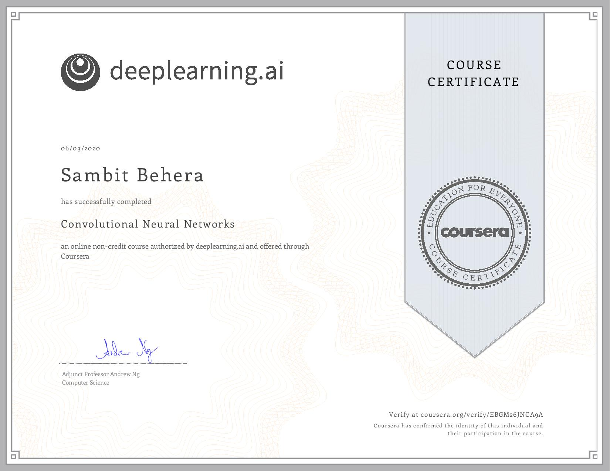

# Convolutional Neural Networks

Fourth course in the specialization. A lot of image processing assignments in this course.

- Basic Convolutional model
- Keras Tutorial - Smile detector
- ResNet Implementation
- Car detection with YOLO
- Face Verification and Recognition
- Neural Style Transfer

