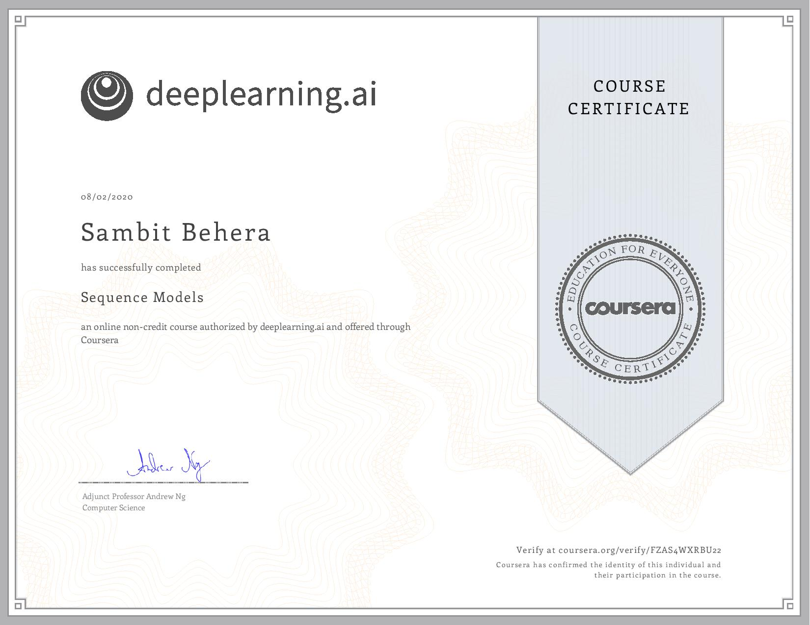

# Convolutional Neural Networks

Fifth course in the specialization.

- Recurrent Neural Networks
- Jazz Music Recreation
- Operations on word vectors
- Emojifier
- Neural Machine Translation
- Trigger Word Detection

